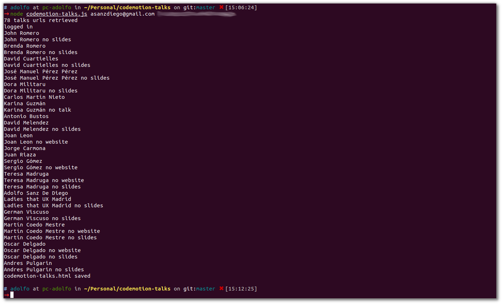

# Listado de los vídeos de las charlas de Codemotion mediante web scraping con Puppeteer

El año pasado dí una [charla en el Codemotion sobre cómo desarrollar aplicaciones descentralizadas en la Blockchain de Etheruem](https://github.com/asanzdiego/codemotion-charla-blockchain). El caso es que hace poco han subido los vídeos de las charlas del evento a la web de Codemotion. El problema es que no me gusta como han organizado la información.

Primero tienes que acceder a la [página de speakers del Codemotion](https://madrid2018.codemotionworld.com/speakers/):

Y luego tienes que acceder a la [página de un speaker del Codemotion](https://madrid2018.codemotionworld.com/speaker/4294/):

Y luego tienes que acceder scroll para ver el título, el resumen y el vídeo de la charla que ha dado:

Pero además, si no estás logueado, no te aparece la charla:

Así que me he entretenido haciendo un script con [Puppeteer](https://pptr.dev/), que es una librería de NodeJS que proporciona una API de alto nivel para controlar Chrome y con el cual podemos hacer web scraping.

Para ejecutar el script tienes que, primero clonar este repositorio:

~~~
git clone git@github.com:asanzdiego/codemotion-talks.git
~~~

Luego [instalar NodeJS](https://nodejs.org/), y luego Puppeteer con el siguiente comando:

~~~
npm install puppeteer
~~~

Y por último ejecutar el siguiente comando poniendo el mail y la contraseña de vuestro usuario de la página de [Codemotion](https://madrid2018.codemotionworld.com/):

~~~
node codemotion-talks.js YOUR_EMAIL YOUR_CODEMOTION_PASSWORD
~~~

El proceso tarda un ratito y os saldrá algo así:

Y al final del proceso obtendréis un bonito fichero **codemotion-talks.html** con toda la información relevante (nombre del ponente, nombre de la charla, resumen de la charla, idioma de la charla y nivel de la charla):

Sois libres de forkear y modificar este proyecto a vuestro gusto :-)